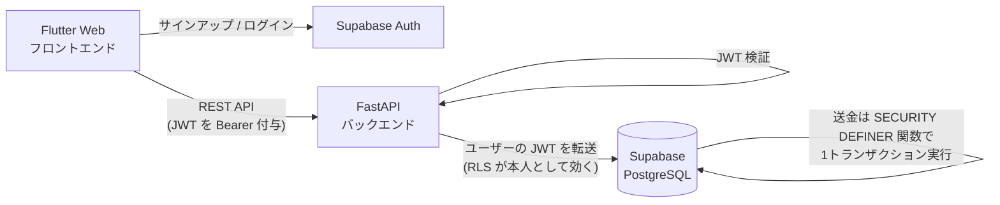

# MegaPay（メガペイ）

メガバンク発・**手軽に送金できるスマホアプリ**の MVP です。
Web アプリ（Flutter Web）として動作し、将来は同じコードベースから iOS / Android ネイティブアプリへ展開できます。

## MVP の機能

| 機能 | 内容 |
| --- | --- |
| 送金 | 相手のユーザーID（例: `MP-12345678`）と金額・通貨を指定して送金。送金前に宛先の表示名を確認できる |
| 残高 | 保有しているすべての通貨の残高を一覧表示（**通貨は限定しない**。JPY/USD/EUR/… 任意のコードに対応） |
| プロフィール | 自分のユーザーIDを表示・コピー。相手に伝えると送金を受け取れる |
| 履歴 | 送金・受取の履歴を新しい順に表示 |

> デモ用に、サインアップすると自動で初期残高（JPY 500,000 / USD 3,000 / EUR 2,000）が付与されます（本番では入金機能に置き換え）。

## 技術スタック

| 層 | 採用技術 |
| --- | --- |
| フロントエンド | Flutter（Web。ネイティブアプリへ展開可能） |
| バックエンド | Python / FastAPI |
| データベース | Supabase PostgreSQL |
| 認証 | Supabase Auth（メール + パスワード） |
| インフラ | Supabase + Flutter Web の静的ホスティング（Vercel / Cloudflare Pages 等） |

## アーキテクチャ



- 送金処理（残高チェック → 減算 → 加算 → 履歴記録）は PostgreSQL 関数 `execute_transfer` が **1 トランザクション**で実行します。行ロック順を固定しており、同時送金でも残高がずれません。
- バックエンドは service_role キーを持たず、**ユーザーの JWT をそのまま Supabase へ転送**します。RLS により本人のデータしか触れません。
- 金額は `numeric(30,8)`（DB）/ `Decimal`（API）で扱い、浮動小数点の誤差を排除しています。API 上の金額は常に**文字列**です。

詳細は [docs/architecture.md](docs/architecture.md) を参照してください。

## セットアップ

### 0. 前提（必要なツールとバージョン）

| ツール | バージョン | 備考 |
| --- | --- | --- |
| [Python](https://www.python.org/) | **3.12 以上**（3.12 / 3.13 で動作確認） | CI・本番（Render）は 3.12 |
| [Flutter SDK](https://docs.flutter.dev/get-started/install) | **3.35 以上**（3.44.8 で動作確認） | stable チャンネル。[pubspec.yaml](frontend/pubspec.yaml) で強制 |
| Supabase アカウント | - | 無料プランで可（チーム参加者は不要） |

ライブラリのバージョンは [backend/requirements.txt](backend/requirements.txt)（Python）と
[frontend/pubspec.yaml](frontend/pubspec.yaml) / `pubspec.lock`（Dart）で管理する。

### 1. Supabase プロジェクトの準備

> **チーム参加者はこの手順は不要です**（開発用プロジェクトの接続情報はリポジトリに設定済み）。
> 新しく Supabase プロジェクトを立てる場合のみ実施してください。

1. [supabase.com](https://supabase.com/) で新規プロジェクトを作成する
2. Dashboard > **SQL Editor** に [supabase/migrations/20260804000000_initial_schema.sql](supabase/migrations/20260804000000_initial_schema.sql) の内容を貼り付けて実行する
   （Supabase CLI 利用者は `supabase link` 後に `supabase db push` でも可）
3. **メール確認をオフにする（デモ用）**: Dashboard > Authentication > Sign In / Providers > Email > 「Confirm email」を OFF にする
   ※ ON のままだとサインアップ直後にログインできません。本番では ON に戻します
4. Dashboard > Settings から以下を控える
   - Project URL（`SUPABASE_URL`。Settings > Data API 内）
   - anon public キー（`SUPABASE_ANON_KEY`。Settings > API Keys > 「Legacy anon, service_role API keys」タブ）

   ※ JWT の検証は JWKS（公開鍵）で自動的に行うため、JWT Secret のコピーは不要です
   （レガシー HS256 プロジェクトの場合のみ `SUPABASE_JWT_SECRET` を設定）

### 2. バックエンド（FastAPI）

Windows（PowerShell）:

```powershell
cd backend
python -m venv .venv
.venv\Scripts\python.exe -m pip install -r requirements-dev.txt
.venv\Scripts\python.exe -m uvicorn app.main:app --reload --port 8000
```

macOS / Linux:

```bash
cd backend
python3 -m venv .venv
.venv/bin/pip install -r requirements-dev.txt
.venv/bin/uvicorn app.main:app --reload --port 8000
```

※ venv の activate は不要（activate は Windows の実行ポリシーに引っかかりやすいため、
venv 内の実行ファイルを直接呼ぶ方式にしている）。2回目以降の起動は最後の1行だけでよい。

開発用の Supabase 接続先は [app/config.py](backend/app/config.py) にデフォルト値として埋め込み済みのため、
**`.env` なしでそのまま起動できる**。別プロジェクトや本番に向ける場合のみ `.env` で上書きする（[.env.example](backend/.env.example) 参照）。

- 動作確認: <http://localhost:8000/health> → `{"status":"ok"}`
- API ドキュメント（Swagger UI）: <http://localhost:8000/docs>

### 3. フロントエンド（Flutter Web）

```bash
cd frontend
flutter pub get
flutter run -d chrome
```

**OS を問わずこれだけで起動する。** 開発用の Supabase 接続先は [lib/config.dart](frontend/lib/config.dart) に
デフォルト値として埋め込み済み（anon キーは RLS 前提の公開可能キーのため同梱している。秘密キーは含まない）。

別プロジェクトや本番向けには `--dart-define` で上書きする：

```bash
flutter run -d chrome --dart-define=SUPABASE_URL=https://xxxx.supabase.co --dart-define=SUPABASE_ANON_KEY=eyJhbGciOi...
```

### 4. 動作確認（デモシナリオ）

1. ブラウザで「口座開設」から **ユーザーを2人** 作成する（例: taro@example.com / hanako@example.com）
2. 花子のホーム画面でユーザーID（`MP-XXXXXXXX`）をコピーする
3. 太郎でログインし「送金する」→ 花子のIDを貼り付け「確認」→ 表示名を確認 → 通貨と金額を入れて送金
4. 双方の残高と履歴に反映されていることを確認する

## テスト

```bash
cd backend
.venv\Scripts\python -m pytest -q
```

Supabase への実アクセスなしで、ルーティング・バリデーション・エラーマッピングを検証します。
CI（GitHub Actions）では push / PR ごとにバックエンドのテストと `flutter analyze` が実行されます。

## デプロイ（MVP 想定）

リポジトリ直下の [render.yaml](render.yaml)（Render Blueprint）で、フロントエンド・バックエンドを一括デプロイできます：

1. [render.com](https://render.com) に GitHub アカウントでサインアップ
2. Dashboard > **New > Blueprint** > `megapay` リポジトリを選択
3. 求められた環境変数（`SUPABASE_URL` / `SUPABASE_ANON_KEY`）を入力して **Apply**
4. 発行された URL（フロント: `megapay-web.onrender.com`）をチームに共有

その他の構成（Vercel / Cloudflare Pages + Railway 等)でも可：

| 対象 | 方法 |
| --- | --- |
| フロントエンド | `flutter build web` → `frontend/build/web` を静的ホスティングに配置（`--dart-define` を本番値でビルド） |
| バックエンド | `uvicorn app.main:app --host 0.0.0.0 --port $PORT` を起動し、`.env` 相当の環境変数を設定 |
| DB / 認証 | Supabase（マイグレーション適用済みプロジェクト） |

本番では `CORS_ORIGINS` をフロントエンドの公開 URL に必ず絞ってください（render.yaml では設定済み）。

## リポジトリ構成

```
megapay/
├── backend/            # FastAPI バックエンド
│   ├── app/            # アプリ本体（ルーター / 認証 / DBアクセス層）
│   └── tests/          # pytest（Supabase なしで実行可能）
├── frontend/           # Flutter Web フロントエンド
│   └── lib/            # 画面・APIクライアント・モデル
├── supabase/
│   └── migrations/     # DB スキーマ（テーブル / RLS / 送金関数）
├── docs/
│   ├── architecture.md # 設計資料（ER図・シーケンス・API仕様）
│   └── backlog.md      # 今後の機能バックログ（アジャイル運用）
└── CONTRIBUTING.md     # チーム開発ルール（ブランチ戦略・コミット規約）
```

## 今後の予定

アジャイルで機能追加していきます。優先順位つきのバックログは [docs/backlog.md](docs/backlog.md) を参照してください（入金・出金、為替変換送金、QRコード送金、プッシュ通知、2要素認証 など）。
