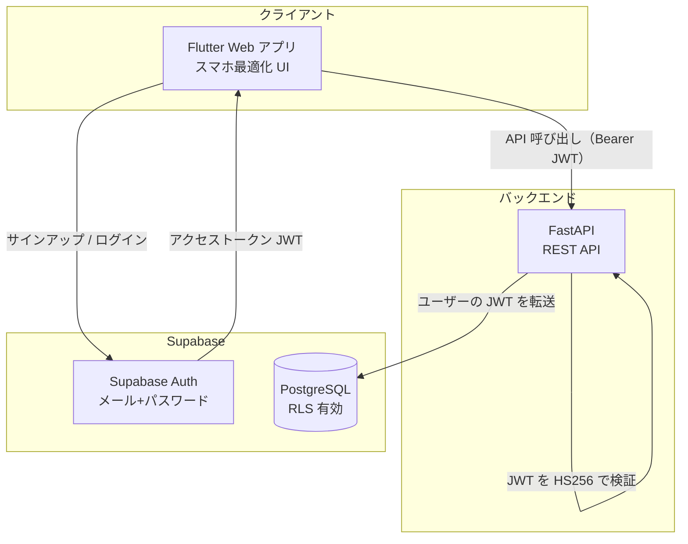
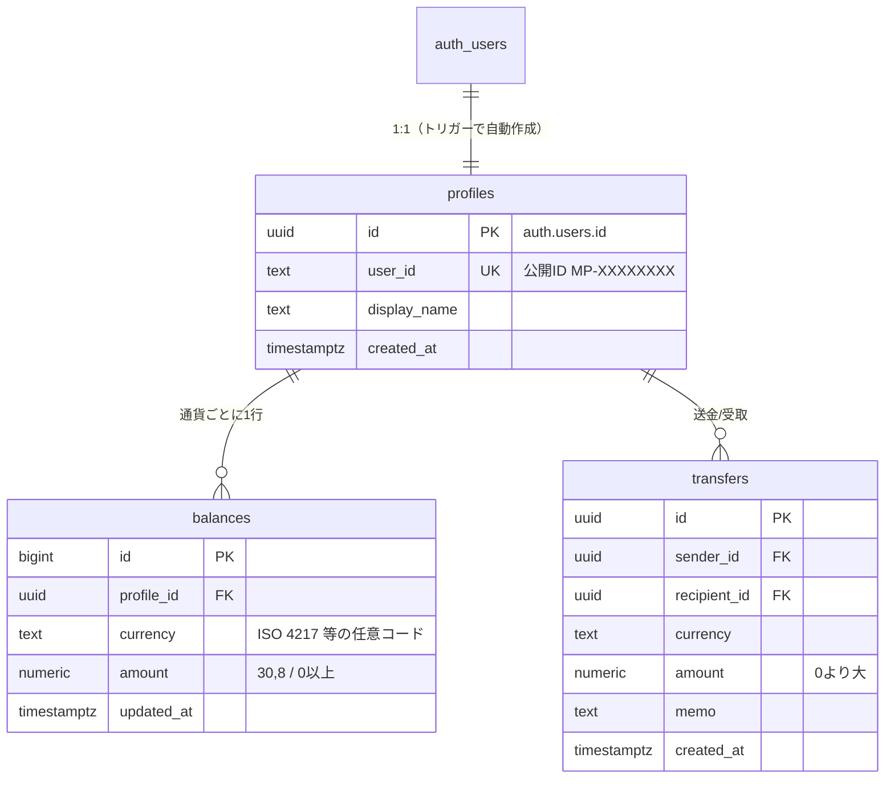
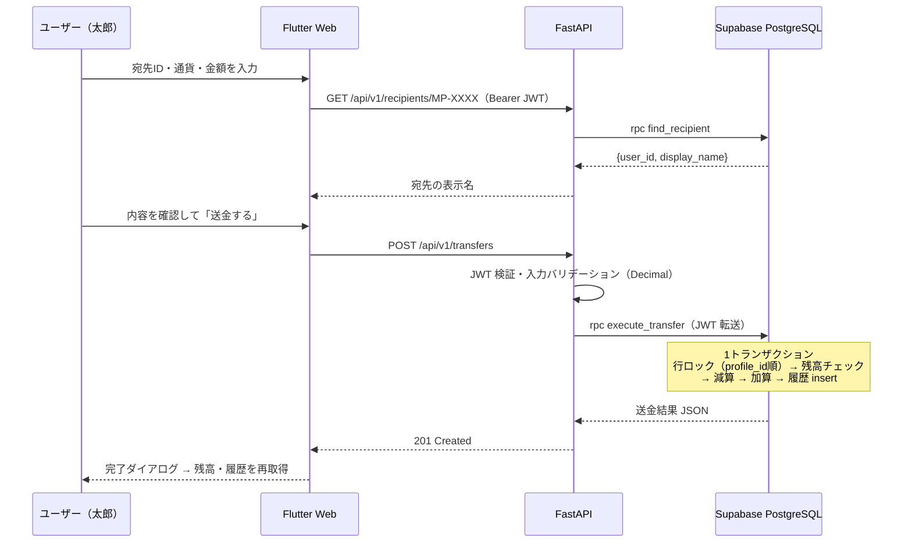

# 設計資料（MVP）

## システム構成

### 設計上のポイント

1. **バックエンドは service_role キーを持たない**
   FastAPI はユーザーの JWT をそのまま PostgREST へ転送する。RLS が「本人」として効くため、
   バックエンドにバグや侵入があっても他ユーザーのデータには到達できない。
2. **送金は DB 関数で原子的に実行**
   `execute_transfer`（SECURITY DEFINER）が残高チェック → 減算 → 加算 → 履歴記録を
   1 トランザクションで行う。行ロックは常に `profile_id` 順で取得し、相互送金の同時実行でも
   デッドロックしない。
3. **金額に浮動小数点を使わない**
   DB: `numeric(30,8)` / API: 文字列 ⇔ Python `Decimal`。通貨は限定せず
   `^[A-Z0-9]{3,10}$` の任意コードを受け付ける（同一通貨間の送金のみ。為替変換はバックログ）。
4. **書き込み経路の一本化**
   テーブルへの insert/update ポリシーは定義していないため、クライアント・バックエンドとも
   直接書き込みできず、必ず検証つきの DB 関数を経由する。

## ER 図

## 送金シーケンス

## API 仕様（v1）

すべて `Authorization: Bearer <Supabase アクセストークン>` が必要（`/health` を除く）。
金額はリクエスト・レスポンスとも**文字列**。

| メソッド | パス | 説明 | 主なエラー |
| --- | --- | --- | --- |
| GET | `/health` | 死活監視 | - |
| GET | `/api/v1/me` | 自分のプロフィール（`user_id`, `display_name`, `email`） | 401 |
| GET | `/api/v1/balances` | 通貨別残高一覧 | 401 |
| GET | `/api/v1/recipients/{user_id}` | 宛先確認（表示名の取得） | 404 宛先なし |
| POST | `/api/v1/transfers` | 送金実行 `{recipient_user_id, currency, amount, memo?}` | 400 残高不足・自分宛て / 404 宛先なし / 422 入力不正 |
| GET | `/api/v1/transfers?limit=50` | 送金・受取履歴（新しい順） | 401 |

エラーレスポンスは `{"detail": "<日本語メッセージ>"}` 形式。
DB 関数の `INSUFFICIENT_FUNDS` 等のエラーキーワードは `backend/app/errors.py` で HTTP ステータスへ変換する。

## セキュリティ（MVP での対応と積み残し）

| 項目 | MVP | 今後 |
| --- | --- | --- |
| 認証 | Supabase Auth（JWT / HS256 検証） | 2FA・生体認証・JWT 非対称鍵化 |
| 認可 | RLS + SECURITY DEFINER 関数のみ書き込み可 | 監査ログ・異常検知 |
| 金額精度 | numeric / Decimal / 文字列受け渡し | - |
| 通信 | 本番 HTTPS 前提・CORS 制限 | レートリミット・WAF |
| 送金制御 | 残高チェック・自分宛て禁止 | 限度額・冪等キー・不正検知・KYC |
