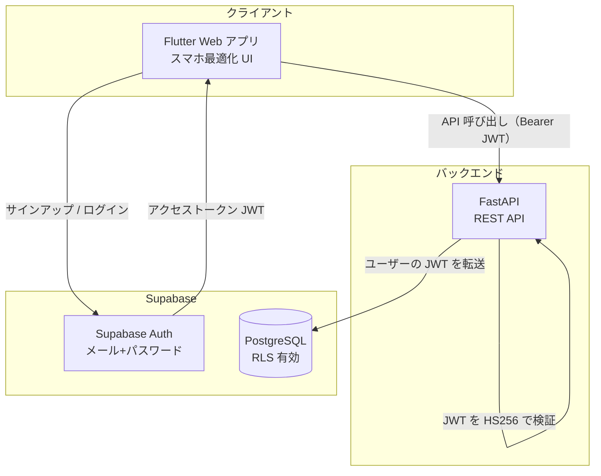
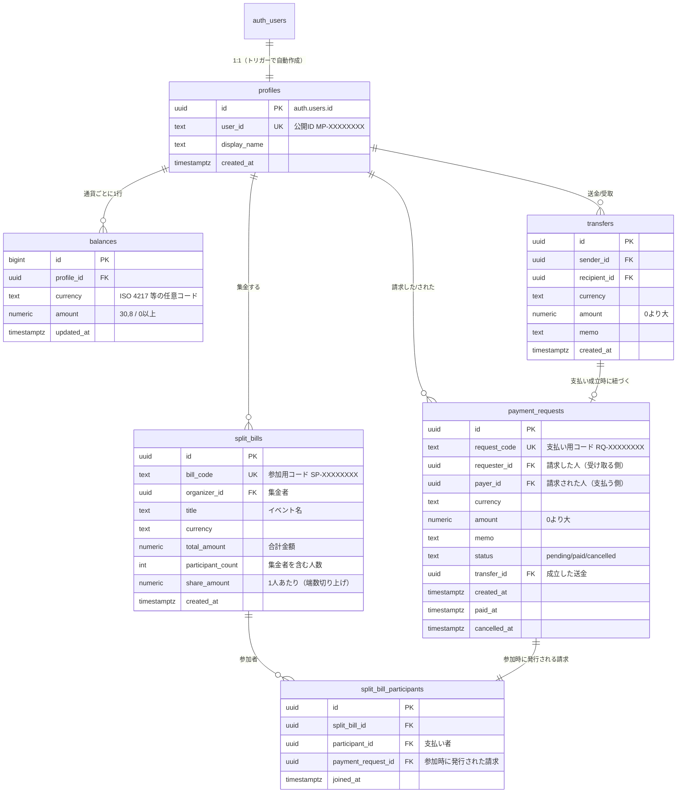
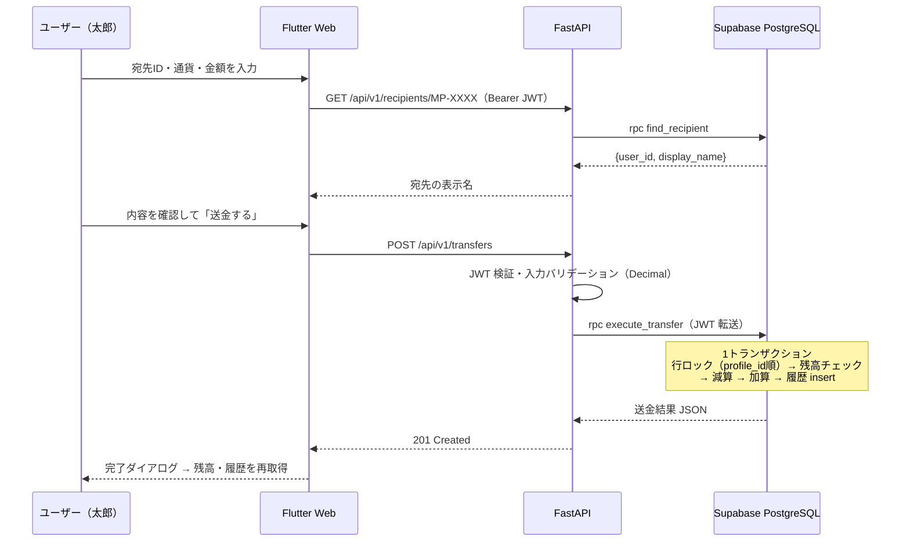
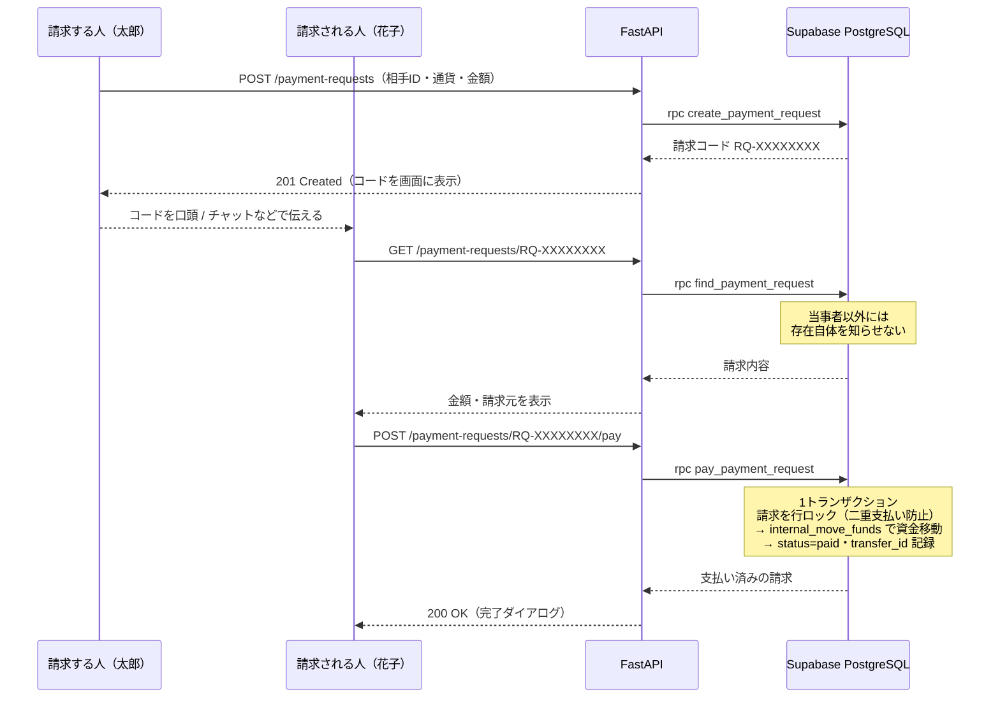
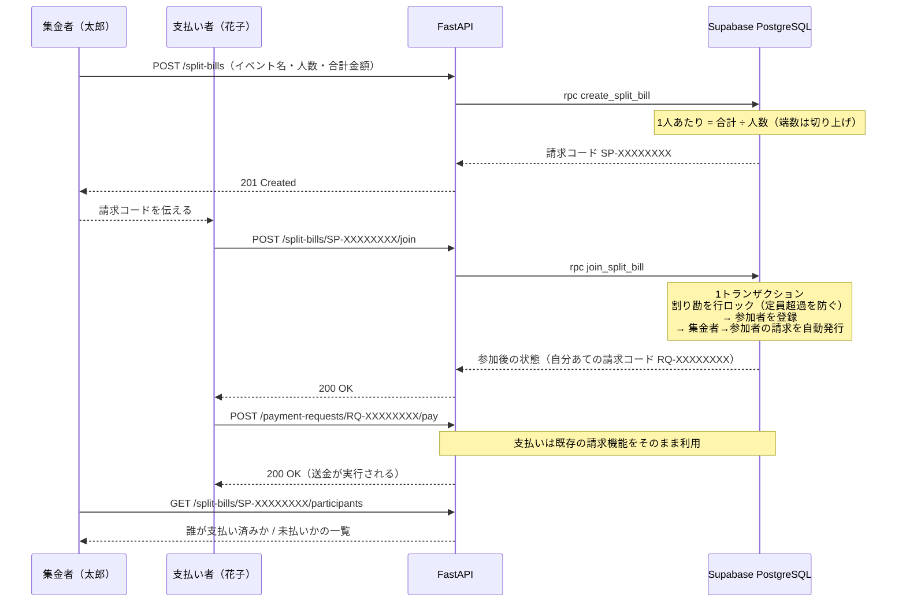

# 設計資料（MVP）

## システム構成

### 設計上のポイント

1. **バックエンドは service_role キーを持たない**
   FastAPI はユーザーの JWT をそのまま PostgREST へ転送する。RLS が「本人」として効くため、
   バックエンドにバグや侵入があっても他ユーザーのデータには到達できない。
2. **送金は DB 関数で原子的に実行**
   `execute_transfer`（SECURITY DEFINER）が残高チェック → 減算 → 加算 → 履歴記録を
   1 トランザクションで行う。行ロックは常に `profile_id` 順で取得し、相互送金の同時実行でも
   デッドロックしない。
3. **金額に浮動小数点を使わない**
   DB: `numeric(30,8)` / API: 文字列 ⇔ Python `Decimal`。通貨は限定せず
   `^[A-Z0-9]{3,10}$` の任意コードを受け付ける（同一通貨間の送金のみ。為替変換はバックログ）。
4. **書き込み経路の一本化**
   テーブルへの insert/update ポリシーは定義していないため、クライアント・バックエンドとも
   直接書き込みできず、必ず検証つきの DB 関数を経由する。

## ER 図

## 送金シーケンス

## 請求シーケンス

送金（`execute_transfer`）と請求の支払い（`pay_payment_request`）は、
どちらも共通の `internal_move_funds` を呼ぶ。資金移動のロジックが 1 箇所にまとまるため、
残高チェック・ロック順序・履歴記録の扱いが両者でずれない。

## 割り勘シーケンス

割り勘は「1つのイベントに対して、参加者ごとに 1 件の請求を作る」構造にしている。
支払い・残高の移動は既存の請求機能（`pay_payment_request` → `internal_move_funds`）を
そのまま通るため、資金移動のロジックは 1 箇所のままになっている。

## API 仕様（v1）

すべて `Authorization: Bearer <Supabase アクセストークン>` が必要（`/health` を除く）。
金額はリクエスト・レスポンスとも**文字列**。

| メソッド | パス | 説明 | 主なエラー |
| --- | --- | --- | --- |
| GET | `/health` | 死活監視 | - |
| GET | `/api/v1/me` | 自分のプロフィール（`user_id`, `display_name`, `email`） | 401 |
| GET | `/api/v1/balances` | 通貨別残高一覧 | 401 |
| GET | `/api/v1/recipients/{user_id}` | 宛先確認（表示名の取得） | 404 宛先なし |
| POST | `/api/v1/transfers` | 送金実行 `{recipient_user_id, currency, amount, memo?}` | 400 残高不足・自分宛て / 404 宛先なし / 422 入力不正 |
| GET | `/api/v1/transfers?limit=50` | 送金・受取履歴（新しい順） | 401 |
| POST | `/api/v1/payment-requests` | 請求作成 `{payer_user_id, currency, amount, memo?}` → 請求コード発行 | 400 自分宛て / 404 相手なし / 422 入力不正 |
| GET | `/api/v1/payment-requests?limit=50` | 請求状況の一覧（した／された） | 401 |
| GET | `/api/v1/payment-requests/{code}` | 請求コードから内容取得（支払い前の確認） | 404 コードなし・当事者以外 |
| POST | `/api/v1/payment-requests/{code}/pay` | 請求コードを指定して支払う | 400 残高不足 / 404 コードなし / 409 支払い済み・取り消し済み |
| POST | `/api/v1/payment-requests/{code}/cancel` | 請求を取り消す（請求者・未払いのみ） | 404 コードなし / 409 支払い済み |
| POST | `/api/v1/split-bills` | 割り勘を登録 `{title, currency, total_amount, participant_count}` → 請求コード発行 | 400 入力不正 / 422 入力不正 |
| GET | `/api/v1/split-bills?limit=50` | 自分が関わる割り勘の一覧 | 401 |
| GET | `/api/v1/split-bills/{code}` | 請求コードから割り勘の内容を取得（参加前の確認） | 404 コードなし |
| POST | `/api/v1/split-bills/{code}/join` | グループに参加（同時に自分あての請求が発行される） | 400 集金者本人 / 404 コードなし / 409 定員超過 |
| GET | `/api/v1/split-bills/{code}/participants` | 参加者と支払い状況の一覧 | 404 コードなし・部外者 |
| GET | `/api/v1/saved-users` | 保存済みユーザー一覧 | 401 |
| POST | `/api/v1/saved-users` | ユーザーを保存 `{user_id}` | 400 自分自身 / 404 宛先なし / 422 入力不正 |

エラーレスポンスは `{"detail": "<日本語メッセージ>"}` 形式。
DB 関数の `INSUFFICIENT_FUNDS` 等のエラーキーワードは `backend/app/errors.py` で HTTP ステータスへ変換する。

## セキュリティ（MVP での対応と積み残し）

| 項目 | MVP | 今後 |
| --- | --- | --- |
| 認証 | Supabase Auth（JWT を JWKS 公開鍵で検証。ES256/RS256/HS256 対応） | 2FA・生体認証 |
| 認可 | RLS + SECURITY DEFINER 関数のみ書き込み可 | 監査ログ・異常検知 |
| 金額精度 | numeric / Decimal / 文字列受け渡し | - |
| 通信 | 本番 HTTPS 前提・CORS 制限 | レートリミット・WAF |
| 送金制御 | 残高チェック・自分宛て禁止 | 限度額・冪等キー・不正検知・KYC |
